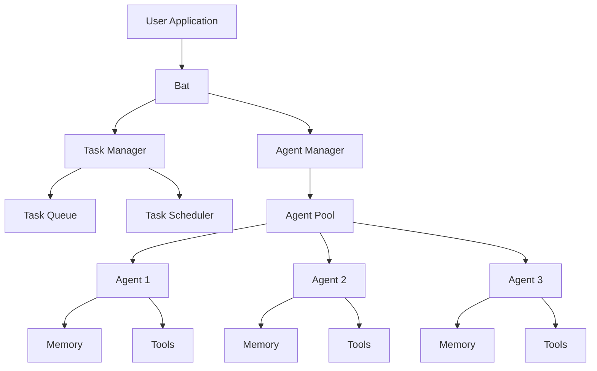
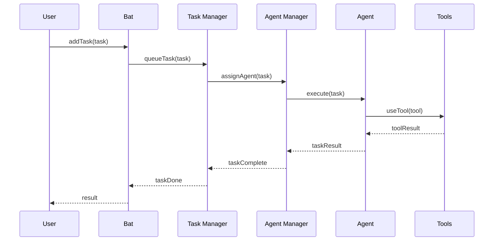
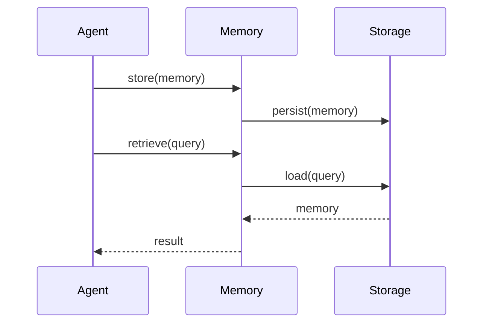

# Architecture

This document describes the architecture of Bat AI Core, including its components, their interactions, and the overall system design.

## System Overview



## Core Components

### 1. Bat

The central orchestrator that manages agents and tasks.

```typescript
class Bat {
  private agents: Agent[];
  private taskManager: TaskManager;
  private agentManager: AgentManager;

  constructor(agents: Agent[]) {
    this.agents = agents;
    this.taskManager = new TaskManager();
    this.agentManager = new AgentManager(agents);
  }

  async addTask(task: Task): Promise<void> {
    await this.taskManager.queueTask(task);
  }

  async kickoff(): Promise<TaskResult[]> {
    return await this.taskManager.executeTasks();
  }
}
```

### 2. Agent

Specialized AI entities that execute tasks.

```typescript
class Agent {
  private role: string;
  private goal: string;
  private backstory: string;
  private model: BaseChatModel;
  private memory?: AgentMemory;
  private tools?: BatTool[];

  constructor(config: AgentConfig) {
    this.role = config.role;
    this.goal = config.goal;
    this.backstory = config.backstory;
    this.model = config.model;
    this.memory = config.memory;
    this.tools = config.tools;
  }

  async execute(task: Task): Promise<string> {
    // Task execution logic
  }
}
```

### 3. Task

Units of work that agents execute.

```typescript
class Task {
  private description: string;
  private agent: Agent;
  private priority: TaskPriority;
  private timeoutMs: number;
  private retryConfig: TaskRetryConfig;

  constructor(
    description: string,
    agent: Agent,
    priority: TaskPriority = "medium",
    timeoutMs: number = 30000,
    retryConfig: TaskRetryConfig = DEFAULT_RETRY_CONFIG
  ) {
    this.description = description;
    this.agent = agent;
    this.priority = priority;
    this.timeoutMs = timeoutMs;
    this.retryConfig = retryConfig;
  }

  async run(): Promise<string> {
    // Task execution with retry logic
  }
}
```

## Component Interactions

### Task Execution Flow



### Memory Management



## Data Flow

### Task Processing

1. **Task Creation**

   - User creates a task
   - Task is added to the queue
   - Priority is assigned

2. **Agent Assignment**

   - Task Manager selects appropriate agent
   - Agent availability is checked
   - Task is assigned to agent

3. **Task Execution**

   - Agent processes task
   - Tools are used as needed
   - Memory is updated
   - Results are returned

4. **Task Completion**
   - Results are processed
   - Memory is updated
   - Next task is scheduled

## Security Considerations

### 1. Tool Execution

- Sandboxed environment
- Resource limits
- Access control
- Input validation

### 2. Memory Management

- Data encryption
- Access control
- Data retention policies
- Backup procedures

### 3. Agent Communication

- Secure channels
- Message validation
- Rate limiting
- Error handling

## Scalability

### Horizontal Scaling

- Multiple agent instances
- Distributed task queue
- Load balancing
- Fault tolerance

### Vertical Scaling

- Resource optimization
- Memory management
- Caching strategies
- Performance monitoring

## Monitoring and Logging

### System Metrics

- Task execution time
- Agent utilization
- Memory usage
- Error rates

### Logging

- Task execution logs
- Agent activity logs
- Error logs
- Performance metrics

## Error Handling

### 1. Task Errors

- Automatic retries
- Error reporting
- Recovery procedures
- Fallback mechanisms

### 2. Agent Errors

- Health checks
- Automatic recovery
- Error isolation
- State preservation

### 3. System Errors

- Graceful degradation
- Error reporting
- Recovery procedures
- Backup systems

## Best Practices

1. **Component Design**

   - Clear interfaces
   - Loose coupling
   - High cohesion
   - Error handling

2. **Resource Management**

   - Efficient allocation
   - Proper cleanup
   - Monitoring
   - Optimization

3. **Security**

   - Input validation
   - Access control
   - Data protection
   - Audit logging

4. **Performance**
   - Caching
   - Optimization
   - Monitoring
   - Scaling
